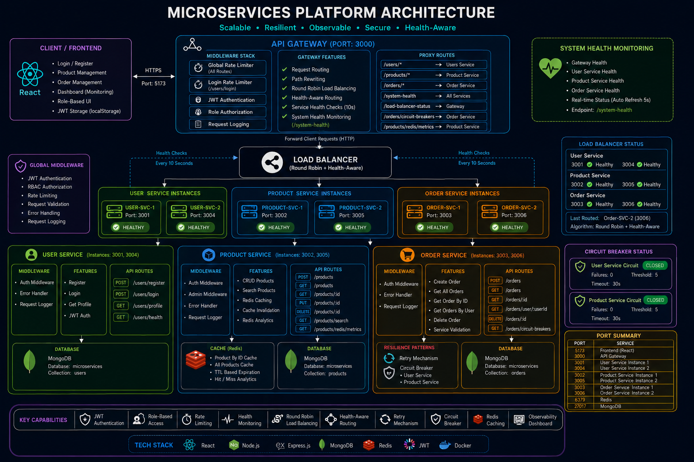
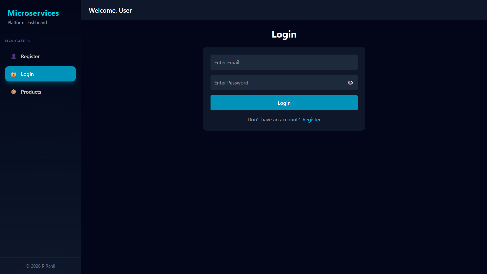
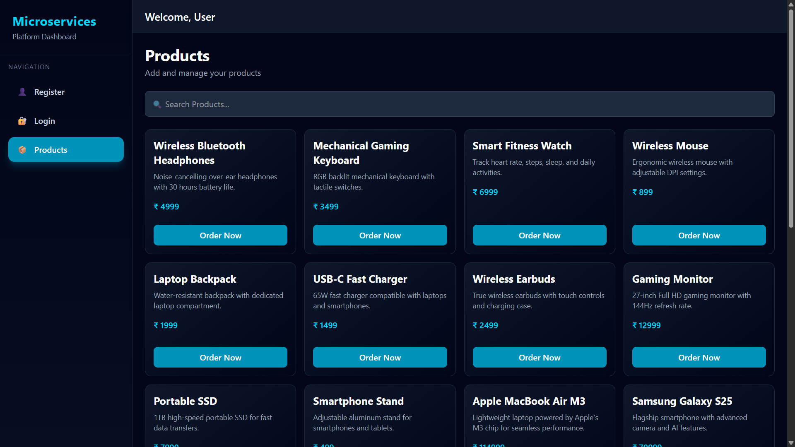
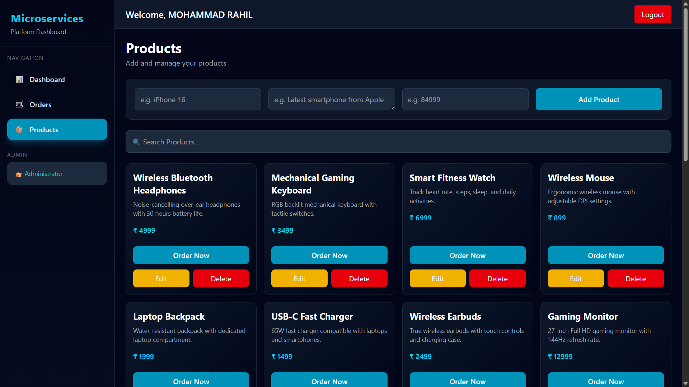
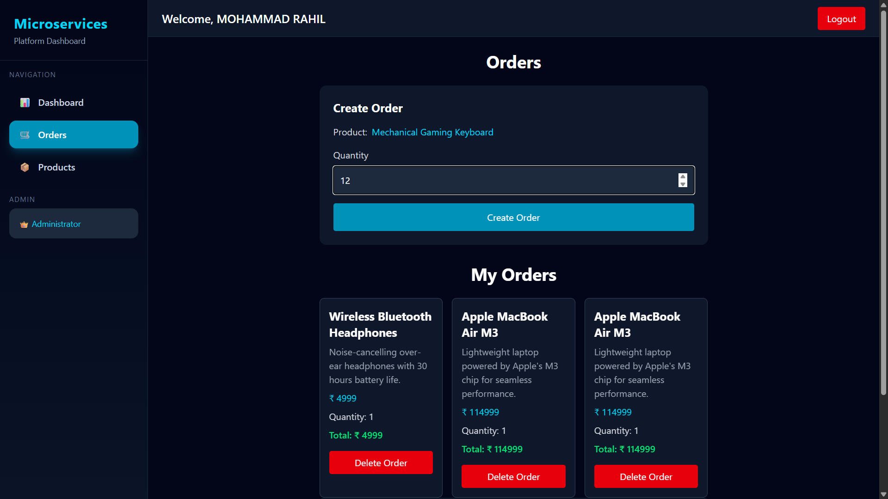
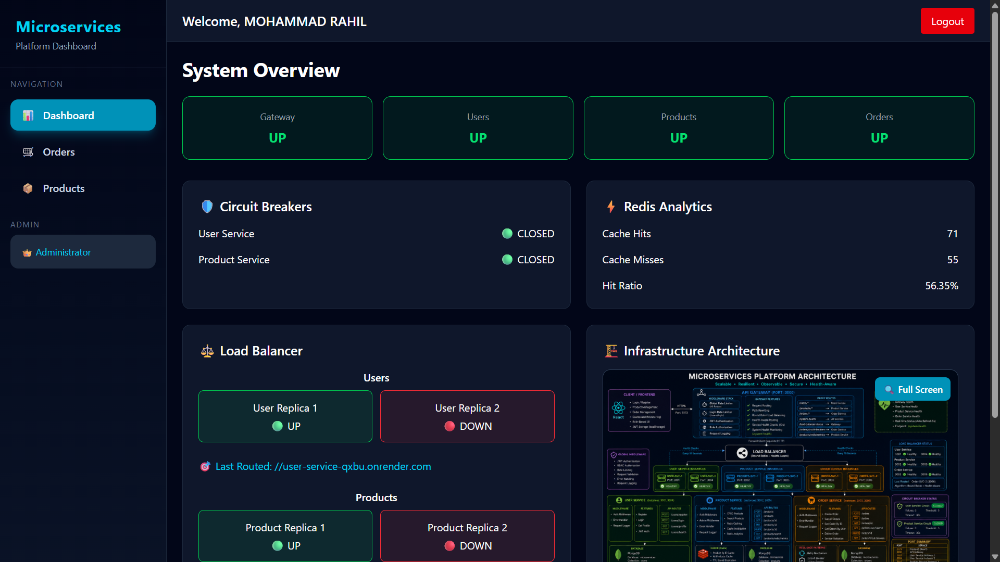
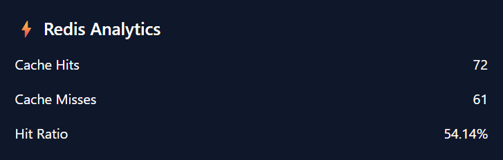
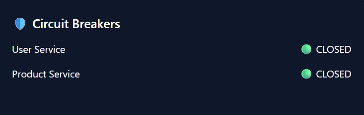
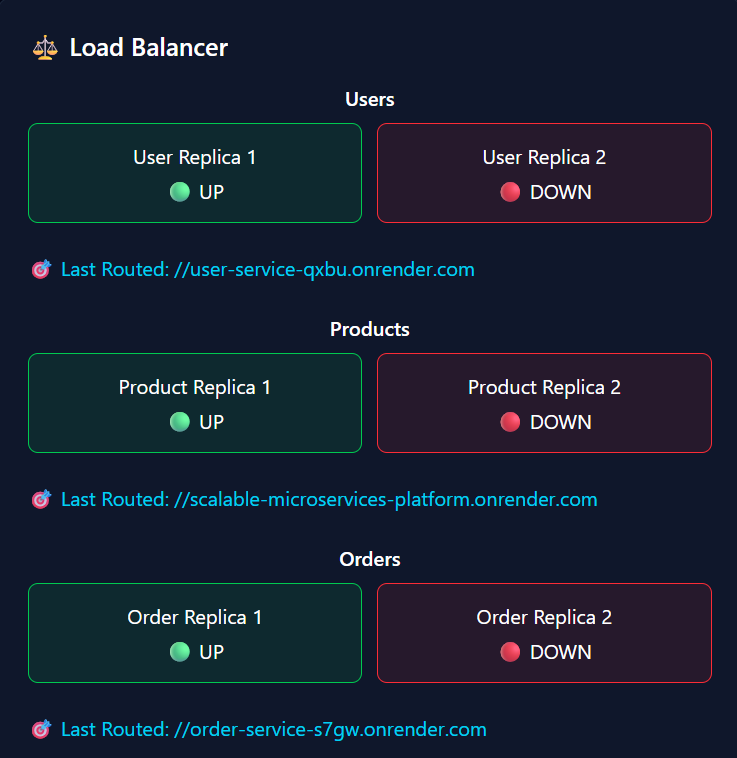

# Scalable Microservices Platform

<p align="center">


</p>

<p align="center">
A <b>Cloud-Native Scalable Microservices Platform</b> built using <b>Node.js, Express, React, Docker, Redis, and MongoDB</b> demonstrating modern backend engineering concepts including <b>API Gateway, Load Balancing, Circuit Breakers, Caching, Health Monitoring, CI/CD, and Cloud Deployment.</b>
</p>

---

# 🌐 Live Demo

### Frontend

🔗 **Live Application:** [Scalable Microservices Platform](https://scalable-microservices-platform.vercel.app/)

### API Gateway

🔗 **Gateway Endpoint:** [Gateway Endpoint](https://gateway-jopq.onrender.com)

---

# ✨ Key Highlights

✅ Microservices Architecture

✅ API Gateway Pattern

✅ JWT Authentication & Authorization

✅ Role-Based Access Control (RBAC)

✅ Round Robin Load Balancing

✅ Health-Aware Routing

✅ Circuit Breaker Pattern

✅ Retry Mechanism

✅ Redis Caching

✅ Health Monitoring Dashboard

✅ Real-Time System Analytics

✅ Dockerized Infrastructure

✅ CI/CD using GitHub Actions

✅ Cloud Deployment using Render + Vercel

---

# 🏗️ Architecture

<p align="center">
  
</p>

---

# 📸 Application Screenshots

## 🔐 Authentication

### Login Page

<p align="center">

</p>

---

## 📦 Product Management

<p align="center">

</p>

---

## 👑 Admin Product Management

<p align="center">

</p>

---

## 🛒 Order Management

<p align="center">

</p>

---

## 📊 Monitoring Dashboard

<p align="center">

</p>

---

## ⚡ Redis Analytics

<p align="center">

</p>

---

## 🛡️ Circuit Breaker Monitoring

<p align="center">

</p>

---

## ⚖️ Load Balancer Dashboard

<p align="center">

</p>

---

# 🏛️ System Architecture

```text
Client (React Frontend)
          │
          ▼
┌──────────────────────────┐
│      API Gateway         │
│  Authentication          │
│  Authorization           │
│  Rate Limiting           │
│  Health Monitoring       │
│  Load Balancing          │
└────────────┬─────────────┘
             │
             ▼

┌────────────┬─────────────┬─────────────┐
│            │             │             │
▼            ▼             ▼
User      Product       Order
Service   Service       Service

│            │             │
▼            ▼             ▼

MongoDB   MongoDB      MongoDB
              │
              ▼
            Redis
```

---

# ⚙️ Core Features

## 🔐 Authentication & Authorization

- User Registration
- User Login
- JWT Authentication
- Role-Based Access Control
- Protected Routes
- Admin Middleware

---

## 🚪 API Gateway

- Central Entry Point
- Request Routing
- Path Rewriting
- JWT Validation
- Request Logging
- Global Error Handling

---

## ⚖️ Load Balancing

Implemented a custom load balancer supporting:

- Round Robin Routing
- Health-Aware Routing
- Automatic Failover
- Replica Monitoring
- Last Routed Instance Tracking

---

## ❤️ Health Monitoring

System performs health checks every 10 seconds.

Monitors:

- Gateway Health
- User Service Health
- Product Service Health
- Order Service Health

---

## 🛡️ Fault Tolerance

### Circuit Breaker Pattern

Features:

- Failure Threshold Tracking
- Automatic Circuit Opening
- Recovery Timeout
- Half-Open Recovery State

---

### Retry Mechanism

Implemented automatic retry logic for:

- User Service Requests
- Product Service Requests

---

## ⚡ Redis Caching

Product service uses Redis for:

- Product By ID Cache
- All Products Cache
- Cache Hit/Miss Tracking
- Cache Invalidation
- TTL Expiration

---

# 📈 Observability Dashboard

The platform provides a real-time monitoring dashboard displaying:

- System Health Status
- Service Availability
- Circuit Breaker Status
- Redis Metrics
- Cache Hit Ratio
- Load Balancer State
- Last Routed Instances

---

# 🧰 Tech Stack

| Category | Technologies |
|----------|-------------|
| Frontend | React, Tailwind CSS, Axios, React Router |
| Backend | Node.js, Express.js |
| Database | MongoDB Atlas |
| Cache | Redis, Upstash Redis |
| Authentication | JWT |
| Containerization | Docker, Docker Compose |
| CI/CD | GitHub Actions |
| Deployment | Render, Vercel |
| Proxy | http-proxy-middleware |
| Dev Tools | Git, GitHub, Nodemon |

---

# 📁 Project Structure

```bash
microservices-platform/
│
├── frontend/
│
├── gateway/
│
├── services/
│   ├── user-service/
│   ├── product-service/
│   └── order-service/
│
├── .github/
│   └── workflows/
│       └── ci.yml
│
├── docker-compose.yml
├── README.md
└── architecture.md
```

---

# 🐳 Docker Setup

## Clone Repository

```bash
git clone https://github.com/rahillll16/scalable-microservices-platform.git

cd scalable-microservices-platform
```

---

## Environment Variables

Create `.env` files for services.

Example:

```env
PORT=3001

MONGO_URI=your_mongodb_connection_string

REDIS_URI=your_redis_connection_string

JWT_SECRET=your_secret_key

JWT_EXPIRES_IN=7d
```

---

## Run Entire Platform

```bash
docker compose up --build
```

---

Application:

```text
Frontend : http://localhost:5173

Gateway  : http://localhost:3000
```

---

# 🔄 CI/CD Pipeline

Implemented using **GitHub Actions**.

Pipeline automatically:

- Installs dependencies
- Builds React frontend
- Builds all microservices
- Builds Docker images
- Validates Docker Compose
- Reports build status

Triggered on:

```text
Push to Main Branch

Pull Requests
```

---

# ☁️ Deployment Architecture

| Service | Platform |
|----------|---------|
| Frontend | Vercel |
| API Gateway | Render |
| User Service | Render |
| Product Service | Render |
| Order Service | Render |
| Database | MongoDB Atlas |
| Cache | Upstash Redis |

---

# 🚀 Future Enhancements

- RabbitMQ / Kafka Integration
- Kubernetes Deployment
- Centralized Logging (ELK Stack)
- Prometheus + Grafana Monitoring
- Unit & Integration Testing
- Service Discovery
- Distributed Tracing

---

# 🎯 Resume Worthy Concepts Demonstrated

- Microservices Architecture
- API Gateway Pattern
- Distributed Systems Fundamentals
- Fault Tolerance
- Load Balancing
- Circuit Breakers
- Caching Strategies
- Containerization
- Cloud Deployment
- CI/CD
- Observability

---

# 👨‍💻 Author

### Mohammad Rahil

- GitHub: https://github.com/rahillll16

---

<p align="center">
⭐ If you found this project interesting, please consider giving it a star!
</p>